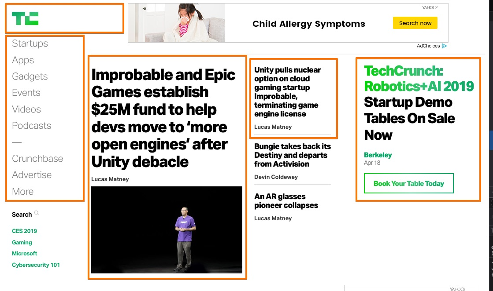

<!-- .slide: class="slide-home" -->
# Sustainable Styles

### Fundamental Principles of CSS Architecture

by Nathan Rambeck <!-- .element style="margin-top: 3em;" -->

 <!-- .element style="height: 50px; vertical-align: -60%; margin-right: 0.3em;" --> [@nrambeck](http://twitter.com/nrambeck)
---

---

---

---

---
# Why CSS Architecture?
---
## Can't we just style our pages?

<figure class="fragment fade-up">
  
  <figcaption><a href="https://unsplash.com/photos/2-KEVc5JRSw">Bradley Swenson</a></figcaption>
</figure>
---
<blockquote class="u-txt-xxl">
  We're not designing pages, we're designing systems of components. 
  —<a href="http://bradfrost.com/blog/mobile/bdconf-stephen-hay-presents-responsive-design-workflow/">Stephen Hay</a>
</blockquote>
---
## Complexity requires planning and organization

<figure class="fragment fade-up">
  
  <figcaption><a href="https://unsplash.com/photos/zCevd81eJDU">Alexandre Perotto</a></figcaption>
</figure>
---
## Scalability Issues

<ul class="u-txt-larger">
  <li class="fragment fade-up">Scaling number of pages/templates</li>
  <li class="fragment fade-up">Scaling complexity (responsive)</li>
  <li class="fragment fade-up">Scaling dev team</li>
</ul>
---
# Styling Components

<blockquote class="u-txt-xxl">
  Tiny Bootstraps for every client 
  —<a href="http://daverupert.com/2013/04/responsive-deliverables/">Dave Rupert</a>
</blockquote>
---
## Thinking in terms of modules and components

<figure class="fragment fade-up">
  
</figure>
---
## Pattern Libraries

<ul class="u-txt-larger">
  <li class="fragment fade-up"><a href="https://github.com/cloudfour/drizzle">Drizzle</a></li>
  <li class="fragment fade-up"><a href="http://fbrctr.github.io/">Fabricator</a></li>
  <li class="fragment fade-up"><a href="http://patternlab.io/">PatternLab</a></li>
  <li class="fragment fade-up"><a href="https://storybook.js.org">React Storybook</a></li>
</ul>
---
## Where these ideas came from

<ul class="u-txt-larger">
  <li class="fragment fade-up"><a href="https://www.smashingmagazine.com/2011/12/an-introduction-to-object-oriented-css-oocss/">Object-Oriented CSS</a> (re-usability) - Nicole Sullivan</li>
  <li class="fragment fade-up"><a href="https://smacss.com">SMACSS</a> (seperation of concerns) - Jonathan Snook</li>
  <li class="fragment fade-up"><a href="http://www.creativebloq.com/web-design/manage-large-scale-web-projects-new-css-architecture-itcss-41514731">ITCSS</a> (style ordering) - Harry Roberts</li>
</ul>
---
# Types of CSS Rules

<ul class="u-txt-larger">
  <li class="fragment fade-up">Base</li>
  <li class="fragment fade-up">Objects</li>
  <li class="fragment fade-up">Components</li>
  <li class="fragment fade-up">State</li>
  <li class="fragment fade-up">Javascript</li>
  <li class="fragment fade-up">Themes</li>
  <li class="fragment fade-up">Utilities</li>
</ul>
---
<ul class="c-overview-list">
  <li class="is-active">Base</li>
  <li>Objects</li>
  <li>Components</li>
  <li>State</li>
  <li>Javascript</li>
  <li>Themes</li>
  <li>Utilities</li>
</ul>
---
# Base CSS

### Styles applied globally to bare elements
---
<pre><code class="css" data-noescape>
body {
  margin: 0;
  padding: 0;
}
a {
  color: Orange;
}
img {
  max-width: 100%;
}
</code></pre>
---
## Base CSS Considerations

<ul class="u-txt-larger">
  <li class="fragment fade-up">Use a project like <a href="https://necolas.github.io/normalize.css/">normalize.css</a></li>
  <li class="fragment fade-up">These are global defaults</li>
  <li class="fragment fade-up">Don't be too heavy-handed</li>
</ul>

---

<ul class="c-overview-list">
  <li>Base</li>
  <li class="is-active">Objects</li>
  <li>Components</li>
  <li>State</li>
  <li>Javascript</li>
  <li>Themes</li>
  <li>Utilities</li>
</ul>

---
# What are objects?

### Re-usable CSS classes for layout and structure <!-- .element: class="fragment fade-in" -->
---
## Recognize layout and structure patterns
<figure class="fragment fade-up">
  
</figure>
---
<!-- .slide: data-transition="fade-out" -->
<pre><code class="css" data-noescape>
.promo {
  max-width: 1000px;
  height: 300px;
  padding: 20px;
  margin: 0 auto;
  position: relative;
  overflow: hidden;
}
</code></pre>
---
<!-- .slide: data-transition="fade-in" -->
<pre><code class="css" data-noescape>
.o-container-wide {
  max-width: 1000px;
  margin: 0 auto;
  overflow: hidden;
}
.promo {
  height: 300px;
  padding: 20px;
}
</code></pre>

<pre class="fragment"><code class="html" data-noescape>
&lt;div class=&quot;promo o-container-wide&quot;&gt;&lt;/div&gt;
</code></pre>
---
## Examples

<ul class="u-txt-larger">
  <li class="fragment fade-up">Grid systems</li>
  <li class="fragment fade-up">Layout containers</li>
  <li class="fragment fade-up">Structural patterns</li>
</ul>
---
<ul class="c-overview-list">
  <li>Base</li>
  <li>Objects</li>
  <li class="is-active">Components</li>
  <li>State</li>
  <li>Javascript</li>
  <li>Themes</li>
  <li>Utilities</li>
</ul>
---
## Components are discrete, self-contained pieces of UI
---
## Examples
<ul class="u-txt-larger">
  <li class="fragment fade-up">Buttons</li>
  <li class="fragment fade-up">Carousels</li>
  <li class="fragment fade-up">Pullquotes</li>
  <li class="fragment fade-up">Header</li>
  <li class="fragment fade-up">Navigation</li>
</ul>
---
## Components make up the bulk of your CSS rules
---
## Independent and self-contained

#### You should be able to drop a component anywhere on any page and it will maintain it's structure and design. <!-- .element: class="fragment fade-in" -->
---
## Components can be small
---
<pre><code class="html" data-noescape>
&lt;button class=&quot;btn&quot;&gt;My Button&lt;/button&gt;
</code></pre>
---
## Components can be big
---
<!-- .slide: data-transition="fade-out" -->

<pre><code class="html" data-noescape>
&lt;footer class=&quot;c-footer&quot;&gt;
  &lt;div class=&quot;o-container-wide&quot;&gt;
    &lt;a class=&quot;c-footer__logo icon-a-assist&quot; href=&quot;/&quot;&gt;The Assist&lt;/a&gt;
    &lt;div class=&quot;c-social c-social--follow&quot;&gt;
      &lt;div class=&quot;c-social__label&quot;&gt;Join the conversation&lt;/div&gt;
      &lt;ul class=&quot;c-social__list&quot;&gt;
        &lt;li class=&quot;c-social__item&quot;&gt;&lt;/li&gt;
        &lt;li class=&quot;c-social__item&quot;&gt;&lt;/li&gt;
        &lt;li class=&quot;c-social__item&quot;&gt;&lt;/li&gt;
      &lt;/ul&gt;
    &lt;/div&gt;
    &lt;p class=&quot;c-footer__credit&quot;&gt;&lt;/p&gt;
  &lt;/div&gt;
&lt;/footer&gt;
</code></pre>
---
<!-- .slide: data-transition="fade-in" -->
<pre><code class="html" data-noescape>
&lt;footer class=&quot;<mark>c-footer</mark>&quot;&gt;
  &lt;div class=&quot;o-container-wide&quot;&gt;
    &lt;a class=&quot;<mark>c-footer__logo</mark> icon-a-assist&quot; href=&quot;/&quot;&gt;The Assist&lt;/a&gt;
    &lt;div class=&quot;c-social c-social--follow&quot;&gt;
      &lt;div class=&quot;c-social__label&quot;&gt;Join the conversation&lt;/div&gt;
      &lt;ul class=&quot;c-social__list&quot;&gt;
        &lt;li class=&quot;c-social__item&quot;&gt;&lt;/li&gt;
        &lt;li class=&quot;c-social__item&quot;&gt;&lt;/li&gt;
        &lt;li class=&quot;c-social__item&quot;&gt;&lt;/li&gt;
      &lt;/ul&gt;
    &lt;/div&gt;
    &lt;p class=&quot;<mark>c-footer__credit</mark>&quot;&gt;&lt;/p&gt;
  &lt;/div&gt;
&lt;/footer&gt;
</code></pre>
---
# Naming Components
---
## BEM

### (Block, Element, Modifier)

#### [http://getbem.com/](http://getbem.com/introduction/)
---
### [block]__[element]--[modifier]
---
<!-- .slide: data-transition="fade-in fade-out" -->

<pre><code class="html" data-noescape>
&lt;div class=&quot;alert alert--warning&quot;&gt;
  &lt;h1 class=&quot;alert__title&quot;&gt;
  &lt;span class=&quot;alert__icon icon-warning&quot;&gt;&lt;/span&gt;
    Alert Title
  &lt;/h1&gt;
  &lt;p class=&quot;alert__description&quot;&gt;The password you entered is invalid.&lt;/p&gt;
&lt;/div&gt;
</code></pre>
---
<!-- .slide: data-transition="fade-in fade-out" -->
<pre><code class="html" data-noescape>
&lt;div class=&quot;<mark>alert</mark> <mark>alert</mark>--warning&quot;&gt;
  &lt;h1 class=&quot;<mark>alert</mark>__title&quot;&gt;
  &lt;span class=&quot;<mark>alert</mark>__icon icon-warning&quot;&gt;&lt;/span&gt;
    Alert Title
  &lt;/h1&gt;
  &lt;p class=&quot;<mark>alert</mark>__description&quot;&gt;The password you entered is invalid.&lt;/p&gt;
&lt;/div&gt;
</code></pre>
---
<!-- .slide: data-transition="fade-in fade-out" -->
<pre><code class="html" data-noescape>
&lt;div class=&quot;alert alert--warning&quot;&gt;
  &lt;h1 class=&quot;alert__<mark>title</mark>&quot;&gt;
  &lt;span class=&quot;alert__<mark>icon</mark> icon-warning&quot;&gt;&lt;/span&gt;
    Alert Title
  &lt;/h1&gt;
  &lt;p class=&quot;alert__<mark>description</mark>&quot;&gt;The password you entered is invalid.&lt;/p&gt;
&lt;/div&gt;
</code></pre>
---
<!-- .slide: data-transition="fade-in fade-out" -->
<pre><code class="html" data-noescape>
&lt;div class=&quot;alert alert--<mark>warning</mark>&quot;&gt;
  &lt;h1 class=&quot;alert__title&quot;&gt;
  &lt;span class=&quot;alert__icon icon-warning&quot;&gt;&lt;/span&gt;
    Alert Title
  &lt;/h1&gt;
  &lt;p class=&quot;alert__description&quot;&gt;The password you entered is invalid.&lt;/p&gt;
&lt;/div&gt;
</code></pre>
---
## Why?

<ul class="u-txt-larger">
  <li class="fragment fade-up">Readability</li>
  <li class="fragment fade-up">Self-descriptive</li>
  <li class="fragment fade-up">Specificity</li>
</ul>
---
<!-- .slide: data-transition="fade-in fade-out" -->
## Specificity Problems

<pre><code class="html" data-noescape>
&lt;div class=&quot;alert warning&quot;&gt;
  &lt;h1&gt;
    &lt;span class=&quot;icon-warning&quot;&gt;&lt;/span&gt;
    Alert Title
  &lt;/h1&gt;
  &lt;p&gt;The password you entered is invalid.&lt;/p&gt;
&lt;/div&gt;
</code></pre>

<pre><code class="css" data-noescape>
.alert { }
.alert.warning { }
.alert h1 { }
.alert span { }
.alert p { }
</code></pre>

---
<ul class="c-overview-list">
  <li>Base</li>
  <li>Objects</li>
  <li>Components</li>
  <li class="is-active">State</li>
  <li>Javascript</li>
  <li>Themes</li>
  <li>Utilities</li>
</ul>
---
### State classes are helpers that modify the state of a component.
---
<!-- .slide: data-transition="fade-in fade-out" -->
<pre><code class="html" data-noescape>
&lt;ul class=&quot;nav&quot;&gt;
  &lt;li class=&quot;nav__item&quot;&gt;Home&lt;/li&gt;
  &lt;li class=&quot;nav__item&quot;&gt;About&lt;/li&gt;
  &lt;li class=&quot;nav__item&quot;&gt;Contact&lt;/li&gt;
&lt;/ul&gt;
</code></pre>
---
<!-- .slide: data-transition="fade-in fade-out" -->
<pre><code class="html" data-noescape>
&lt;ul class=&quot;nav&quot;&gt;
  &lt;li class=&quot;nav__item&quot;&gt;Home&lt;/li&gt;
  &lt;li class=&quot;nav__item <mark>is-active</mark>&quot;&gt;About&lt;/li&gt;
  &lt;li class=&quot;nav__item&quot;&gt;Contact&lt;/li&gt;
&lt;/ul&gt;
</code></pre>
---
<!-- .slide: data-transition="fade-in fade-out" -->
<pre><code class="css" data-noescape>
.nav__item {
  display: inline-block;
  padding: .5em;
}
.nav__item<mark>.is-active</mark> {
  font-weight: bold;
}
</code></pre>
---
### It's common to add remove state classes with Javascript.
---
### State classes begin with "is" or "has"

<ul class="u-txt-larger">
  <li class="fragment fade-up">.is-active</li>
  <li class="fragment fade-up">.is-hidden</li>
  <li class="fragment fade-up">.is-selected</li>
  <li class="fragment fade-up">.has-focus</li>
</ul>

---
<ul class="c-overview-list">
  <li>Base</li>
  <li>Objects</li>
  <li>Components</li>
  <li>State</li>
  <li>Javascript</li>
  <li class="is-active">Themes</li>
  <li>Utilities</li>
</ul>
---
## Theme Classes

### Alter components with unique colors, fonts or other decorations
---
<!-- .slide: data-transition="fade-in fade-out" -->
<pre><code class="html" data-noescape>
&lt;blockquote class=&quot;c-pullquote <mark>t-light</mark>&quot;&gt;
  &lt;p&gt;A great quote from someone special.&lt;/p&gt;
&lt;/blockquote&gt;
</code></pre>

<pre class="fragment"><code class="css" data-noescape>
.c-pullquote {
  font-size: 2em;
  font-style: italic;
}
.t-light {
  background-color: cream;
  color: magenta;
}
.t-dark {
  background-color: magenta;
  color: cream;
}
</code></pre>
---
<ul class="c-overview-list">
  <li>Base</li>
  <li>Objects</li>
  <li>Components</li>
  <li>State</li>
  <li>Javascript</li>
  <li>Themes</li>
  <li class="is-active">Utilities</li>
</ul>
---
## Utilities

### Single purpose helpers that apply one specific styling rule
---
## Examples of Utilities

<pre class="fragment"><code class="css" data-noescape>
.u-sp {
  margin-bottom: 1em !important;
}
.u-clearfix:after {
  content: " ";
  display: block; clear: both; visibility: hidden;
  height: 0; font-size: 0;
}
.u-txt-center {
  text-align: center !important;
}
</code></pre>

<pre class="fragment"><code class="html" data-noescape>
&lt;div class=&quot;promo <mark>u-sp</mark>&quot;&gt;&lt;/div&gt;
&lt;div class=&quot;promo <mark>u-sp</mark>&quot;&gt;&lt;/div&gt;
&lt;div class=&quot;promo&quot;&gt;&lt;/div&gt;
</code></pre>

---
### Tweak your layout

### or

### slightly modify a component...

### without creating another variant

---
## Don't Overdo It!

<pre class="fragment"><code class="html" data-noescape>
&lt;div class=&quot;
  border-top-width-1-dot-04em
  border-top-style-dotted
  border-top-color-lightgrey
  border-bottom-width-12px
  border-bottom-style-solid
  border-bottom-color-cornflowerblue
  border-top-right-radius-1-dot-60em
  padding-5px
  margin-left-10px
  background-color-fuchsia
&quot;&gt;
&lt;/div&gt;
</code></pre>

from <a href="https://github.com/marmelab/universal.css">universal.css</a> a parody of
<a href="http://acss.io/">Atomic CSS</a>

---
## Naming Your Classes
---
## Naming Things is Hard

see [Sparkbox Foundry post](https://seesparkbox.com/foundry/naming_css_stuff_is_really_hard)

<ul class="u-txt-larger">
  <li class="fragment fade-up">All lowercase</li>
  <li class="fragment fade-up">Use dashes or underscores</li>
  <li class="fragment fade-up">Long enough to discern (`.pullquote` not `.pq`)</li>
  <li class="fragment fade-up">No longer than needs to be (`.btn` not `.button`)</li>
</ul>

---
## Naming Methodologies

<ul class="u-txt-larger">
  <li class="fragment fade-up">By Presentation</li>
  <li class="fragment fade-up">By Content</li>
  <li class="fragment fade-up">By Function</li>
</ul>

---
#### By Presentation

<pre><code class="css" data-noescape>
.button--green { }
.rounded-image { }
.large-heading { }
</code></pre>

#### By Content

<pre><code class="css" data-noescape>
.button--submit { }
.profile-image { }
.article-heading { }
</code></pre>

#### By Function

<pre><code class="css" data-noescape>
.button--primary { }
.decorative-image { }
.content-heading { }
</code></pre>

---
## Namespacing

#### Add prefixes to all of your classes to recognize the purpose of each one.

<ul class="u-txt-larger">
  <li class="fragment fade-up">Objects: `.o-`</li>
  <li class="fragment fade-up">Components: `.c-`</li>
  <li class="fragment fade-up">State: `.is-` or `.has-`</li>
  <li class="fragment fade-up">Theme: `.t-`</li>
  <li class="fragment fade-up">Utility: `.u-`</li>
</ul>

---

<!-- .slide: data-transition="fade-in fade-out" -->
<pre><code class="html" data-noescape>
&lt;footer class=&quot;c-footer&quot;&gt;
  &lt;div class=&quot;o-container-wide&quot;&gt;
    &lt;a class=&quot;c-footer__logo&quot; href=&quot;/&quot;&gt;The Assist&lt;/a&gt;
    &lt;div class=&quot;c-social c-social--follow&quot;&gt;
      &lt;div class=&quot;c-social__label u-txt-center&quot;&gt;Join the conversation&lt;/div&gt;
      &lt;ul class=&quot;c-social__list&quot;&gt;
        &lt;li class=&quot;c-social__item&quot;&gt;&lt;/li&gt;
        &lt;li class=&quot;c-social__item is-active&quot;&gt;&lt;/li&gt;
        &lt;li class=&quot;c-social__item&quot;&gt;&lt;/li&gt;
      &lt;/ul&gt;
    &lt;/div&gt;
    &lt;p class=&quot;c-footer__credit&quot;&gt;&lt;/p&gt;
  &lt;/div&gt;
&lt;/footer&gt;
</code></pre>

---
<!-- .slide: data-transition="fade-in fade-out" -->
<pre><code class="html" data-noescape>
&lt;footer class=&quot;c-footer&quot;&gt;
  &lt;div class=&quot;<mark>o-container-wide</mark>&quot;&gt;
    &lt;a class=&quot;c-footer__logo&quot; href=&quot;/&quot;&gt;The Assist&lt;/a&gt;
    &lt;div class=&quot;c-social c-social--follow&quot;&gt;
      &lt;div class=&quot;c-social__label u-txt-center&quot;&gt;Join the conversation&lt;/div&gt;
      &lt;ul class=&quot;c-social__list&quot;&gt;
        &lt;li class=&quot;c-social__item&quot;&gt;&lt;/li&gt;
        &lt;li class=&quot;c-social__item is-active&quot;&gt;&lt;/li&gt;
        &lt;li class=&quot;c-social__item&quot;&gt;&lt;/li&gt;
      &lt;/ul&gt;
    &lt;/div&gt;
    &lt;p class=&quot;c-footer__credit&quot;&gt;&lt;/p&gt;
  &lt;/div&gt;
&lt;/footer&gt;
</code></pre>

---

<!-- .slide: data-transition="fade-in fade-out" -->
<pre><code class="html" data-noescape>
&lt;footer class=&quot;<mark>c-footer</mark>&quot;&gt;
  &lt;div class=&quot;o-container-wide&quot;&gt;
    &lt;a class=&quot;c-footer__logo&quot; href=&quot;/&quot;&gt;The Assist&lt;/a&gt;
    &lt;div class=&quot;<mark>c-social</mark> c-social--follow&quot;&gt;
      &lt;div class=&quot;c-social__label u-txt-center&quot;&gt;Join the conversation&lt;/div&gt;
      &lt;ul class=&quot;c-social__list&quot;&gt;
        &lt;li class=&quot;c-social__item&quot;&gt;&lt;/li&gt;
        &lt;li class=&quot;c-social__item is-active&quot;&gt;&lt;/li&gt;
        &lt;li class=&quot;c-social__item&quot;&gt;&lt;/li&gt;
      &lt;/ul&gt;
    &lt;/div&gt;
    &lt;p class=&quot;c-footer__credit&quot;&gt;&lt;/p&gt;
  &lt;/div&gt;
&lt;/footer&gt;
</code></pre>
---

<!-- .slide: data-transition="fade-in fade-out" -->
<pre><code class="html" data-noescape>
&lt;footer class=&quot;c-footer&quot;&gt;
  &lt;div class=&quot;o-container-wide&quot;&gt;
    &lt;a class=&quot;c-footer__logo&quot; href=&quot;/&quot;&gt;The Assist&lt;/a&gt;
    &lt;div class=&quot;c-social c-social--follow&quot;&gt;
      &lt;div class=&quot;c-social__label u-txt-center&quot;&gt;Join the conversation&lt;/div&gt;
      &lt;ul class=&quot;c-social__list&quot;&gt;
        &lt;li class=&quot;c-social__item&quot;&gt;&lt;/li&gt;
        &lt;li class=&quot;c-social__item <mark>is-active</mark>&quot;&gt;&lt;/li&gt;
        &lt;li class=&quot;c-social__item&quot;&gt;&lt;/li&gt;
      &lt;/ul&gt;
    &lt;/div&gt;
    &lt;p class=&quot;c-footer__credit&quot;&gt;&lt;/p&gt;
  &lt;/div&gt;
&lt;/footer&gt;
</code></pre>

---

<!-- .slide: data-transition="fade-in fade-out" -->
<pre><code class="html" data-noescape>
&lt;footer class=&quot;c-footer&quot;&gt;
  &lt;div class=&quot;o-container-wide&quot;&gt;
    &lt;a class=&quot;c-footer__logo&quot; href=&quot;/&quot;&gt;The Assist&lt;/a&gt;
    &lt;div class=&quot;c-social c-social--follow&quot;&gt;
      &lt;div class=&quot;c-social__label <mark>u-txt-center</mark>&quot;&gt;Join the conversation&lt;/div&gt;
      &lt;ul class=&quot;c-social__list&quot;&gt;
        &lt;li class=&quot;c-social__item&quot;&gt;&lt;/li&gt;
        &lt;li class=&quot;c-social__item is-active&quot;&gt;&lt;/li&gt;
        &lt;li class=&quot;c-social__item&quot;&gt;&lt;/li&gt;
      &lt;/ul&gt;
    &lt;/div&gt;
    &lt;p class=&quot;c-footer__credit&quot;&gt;&lt;/p&gt;
  &lt;/div&gt;
&lt;/footer&gt;
</code></pre>

---
# Code Organization
---
#### Use a preprocessor (Sass, Less, Stylus) to take advantage of:

<ul class="u-txt-larger">
  <li class="fragment fade-up">Imports</li>
  <li class="fragment fade-up">Variables</li>
  <li class="fragment fade-up">Functions</li>
  <li class="fragment fade-up">Mixins</li>
  <li class="fragment fade-up">Nesting</li>
</ul>

---
## Divide styles into meaningful files

<pre><code class="scss" data-noescape>
@import "variables";
@import "mixins";
@import "normalize";
@import "typography";
@import "headings";
@import "buttons";
@import "layout";
@import "carousel";
</code></pre>

---
## Prefix your variable names

<pre><code class="scss" data-noescape>
// Colors
$c-warning: red;
$c-primary: blue;
$c-background: white;
</code></pre>

<figure class="fragment fade-up">
  
</figure>

---
## Scope your variables

<pre><code class="scss" data-noescape>
.alert {
  $background-color: red;
  $foreground-color: cream;
  
  background-color: $background-color;
  color: $foreground-color;
}
</code></pre>

---
# Source Ordering

### The Inverted Triangle Method
---
## ITCSS Will Prevent

<ul class="u-txt-larger">
  <li class="fragment fade-up">Namespace Collisions</li>
  <li class="fragment fade-up">Specificity Wrestling</li>
  <li class="fragment fade-up">Leaky Styles</li>
  <li class="fragment fade-up">Inadvertant Regressions</li>
</ul>

Note: ITCSS is a method of ordering your CSS settings and rules to prevent 
namespace collisions, specificity wrestling, leaky styles and inadvertent 
regressions.
---
<figure>
  
</figure>
---
<figure>
  
</figure>
---
<pre><code class="scss" data-noescape>
@import "settings.global";
@import "settings.colors";
@import "tools.functions";
@import "tools.mixins";
@import "generic.box-sizing";
@import "generic.normalize";
@import "elements.headings";
@import "elements.links";
@import "objects.wrappers";
@import "objects.grid";
@import "components.nav";
@import "components.buttons";
@import "components.promos";
@import "trumps.utilities";
@import "trumps.ie8";
</code></pre>
---
# Questions?

 <!-- .element style="height: 80px; vertical-align: -100%; margin: 0 0.3em;" -->  
[@nrambeck](http://twitter.com/nrambeck) <!-- .element class="u-txt-xl" -->

 <!-- .element style="min-width: 400px; background: white" -->

#### [https://nrambeck.github.io/css-architecture/](https://nrambeck.github.io/css-architecture/)

Note: please provide feedback
